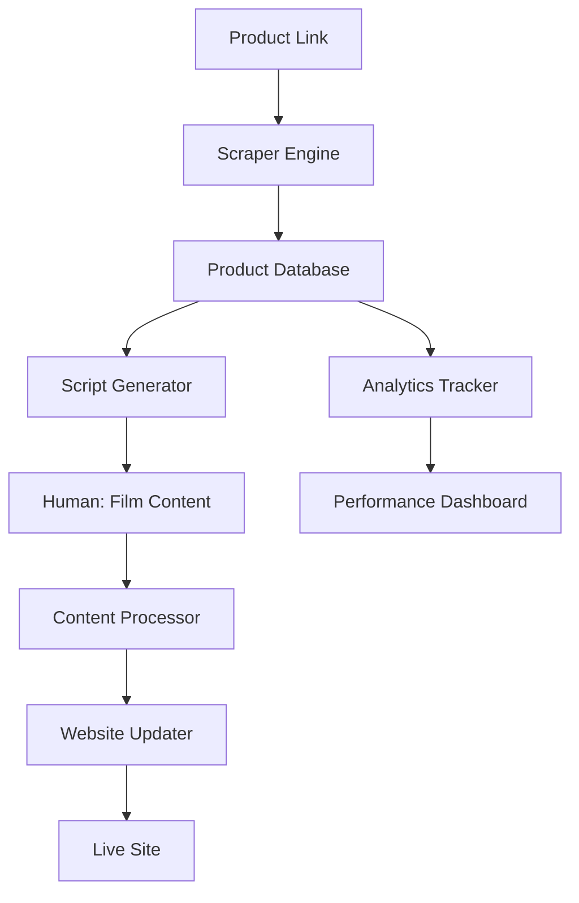

# 🏠 Myhome DIY Management System

**Your AI-Powered Content Production & Website Management Hub**

## 📋 System Overview

This system automates the entire workflow from product research to website deployment, minimizing manual work and maximizing profitability.



## 🗂️ Directory Structure

```
myhome-manager/
├── database/              # Product & content databases
│   ├── products.json      # All products by category
│   ├── content-ideas.json # Planned content
│   ├── published.json     # Published content
│   └── analytics.json     # Performance data
├── scrapers/              # Web scraping tools
│   ├── scraper.py         # Main scraper engine
│   └── extractors/        # Category-specific extractors
├── generators/            # Content generation
│   ├── script_generator.py    # Video script templates
│   ├── html_generator.py      # Product HTML snippets
│   └── seo_optimizer.py       # SEO optimization
├── automation/            # Workflow automation
│   ├── workflow.py        # Main workflow orchestrator
│   ├── site_updater.py    # Auto-update products.html
│   └── task_manager.py    # Human task list generator
├── templates/             # Content templates
│   ├── video_scripts/     # Script templates by category
│   └── html_snippets/     # HTML component templates
├── dashboards/            # Visual management
│   ├── pipeline.md        # Production pipeline
│   └── analytics.md       # Performance metrics
└── config.yaml            # System configuration
```

## 🚀 Quick Start

### 1. Add New Product
```bash
python myhome-manager/cli.py add-product "https://example.com/product" --category home
```

### 2. Generate Video Script
```bash
python myhome-manager/cli.py generate-script PROD_ID
```

### 3. Update Website
```bash
python myhome-manager/cli.py deploy-product PROD_ID
```

### 4. View Dashboard
```bash
python myhome-manager/cli.py dashboard
```

## 📦 Categories

- 🏠 **home** - Home Decor/Utility
- 👶 **baby** - Mother & Baby
- 🌸 **garden** - Gardening (Roses)
- ☕ **cafe** - Cafe & Equipment
- 🎁 **musthave** - Must-Have Items

## 🎬 Workflow Phases

### Phase 1: AI Analysis & Script Generation
- Scrape product details
- Extract images, specs, pricing
- Generate TikTok/Reels script with hooks
- Create talking points

### Phase 2: Human Content Creation
- Film based on provided script
- Capture product footage
- Record voiceover/review

### Phase 3: AI Deployment
- Process final content
- Update products.html
- Deploy to GitHub Pages
- Track analytics

## 🔧 Configuration

Edit `config.yaml` to customize:
- Scraping behavior
- Script tone/style
- SEO settings
- Affiliate link handling
- Deployment options

## 📊 Performance Tracking

The system tracks:
- Product views
- Click-through rates
- Video performance
- Revenue attribution
- Content pipeline status

All data stored in `database/analytics.json`.
