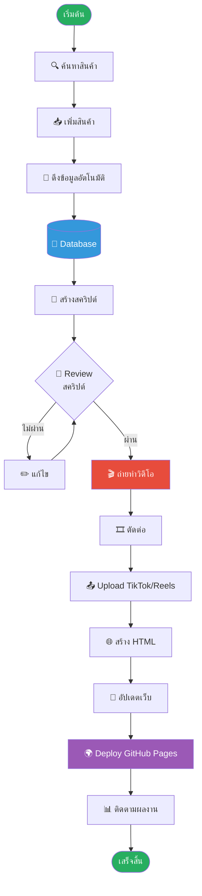

# 📊 Production Pipeline - Myhome DIY

**สถานะ:** อัปเดต 24 เม.ย. 2026

## 🎯 ภาพรวมกระบวนการผลิตคอนเทนต์



## 📋 รายละเอียดแต่ละขั้นตอน

### Phase 1: Research & Data (AI)

#### 🔍 1.1 ค้นหาสินค้า
- **ผู้ทำ:** Human
- **เวลา:** 10-30 นาที
- **Output:** URL สินค้าที่น่าสนใจ

**แหล่งหาสินค้า:**
- Shopee trending
- Lazada bestsellers
- TikTok Shop viral products
- กลุ่ม Facebook รีวิวของ

#### 📥 1.2 เพิ่มสินค้า
- **ผู้ทำ:** Human + AI
- **เวลา:** 1-2 นาที
- **คำสั่ง:**
  ```bash
  python cli.py add-product "URL" --category home
  ```

#### 🤖 1.3 ดึงข้อมูลอัตโนมัติ (Scraping)
- **ผู้ทำ:** AI (Automatic)
- **เวลา:** 5-10 วินาที
- **ข้อมูลที่ดึง:**
  - ชื่อสินค้า
  - ราคา
  - รูปภาพ 5-10 ภาพ
  - คำอธิบาย
  - คะแนน + รีวิว
  - ชื่อผู้ขาย

#### 💾 1.4 บันทึก Database
- **ผู้ทำ:** AI (Automatic)
- **Location:** `database/products.json`
- **จัดเก็บตาม:** Category (home/baby/garden/cafe/musthave)

---

### Phase 2: Script Generation (AI)

#### 📝 2.1 สร้างสคริปต์วิดีโอ
- **ผู้ทำ:** AI
- **เวลา:** 2-3 วินาที
- **คำสั่ง:**
  ```bash
  python cli.py generate-script PROD_ID
  ```

**สไตล์สคริปต์:**
- **Short** (30-45s) - TikTok/Reels
- **Medium** (60-90s) - รีวิวสั้น
- **Long** (2-3 นาที) - รีวิวละเอียด

**โครงสร้างสคริปต์:**
1. **Hook** (3s) - ดึงดูดความสนใจ
2. **Intro** (5s) - แนะนำสินค้า
3. **Features** (20s) - จุดเด่น
4. **Demo** (15s) - สาธิตการใช้
5. **Verdict** (7s) - สรุป
6. **CTA** (5s) - เรียกร้องให้ดูลิงก์

#### 👀 2.2 Review สคริปต์
- **ผู้ทำ:** Human
- **เวลา:** 5-10 นาที
- **ตรวจสอบ:**
  - ภาษาถูกต้อง เป็นธรรมชาติ
  - ข้อมูลครบถ้วน ถูกต้อง
  - โทนเสียงเหมาะสม (casual, friendly)
  - ความยาวพอดี

#### ✏️ 2.3 แก้ไข (ถ้าจำเป็น)
- ปรับคำพูดให้ natural
- เพิ่ม/ลดเนื้อหา
- ใส่บุคลิกตัวเอง

---

### Phase 3: Content Creation (Human)

#### 🎬 3.1 ถ่ายทำวิดีโอ
- **ผู้ทำ:** Human
- **เวลา:** 30-60 นาที
- **อุปกรณ์:**
  - สมาร์ทโฟน / กล้อง
  - ไฟ LED / แสงธรรมชาติ
  - ไมโครโฟน (แนะนำ)
  - ขาตั้ง

**ช็อตที่ต้องถ่าย:**
- [ ] Opening hook
- [ ] สินค้าทั้งชิ้น (หมุน 360°)
- [ ] รายละเอียด (ซูมเข้า)
- [ ] การใช้งานจริง
- [ ] ผลลัพธ์
- [ ] Closing + CTA

#### 🎞️ 3.2 ตัดต่อ
- **ผู้ทำ:** Human
- **เวลา:** 20-45 นาที
- **Software:** CapCut / InShot / Adobe Premiere

**เพิ่มเติม:**
- Text overlay (ข้อความสำคัญ)
- Transitions (การเปลี่ยนฉาก)
- Music (เพลงพื้นหลัง)
- Color grading (ปรับสี)

#### 📤 3.3 Upload
- **Platform:** TikTok, Instagram Reels, Facebook Reels
- **Hashtags:** #MyhomeDIY #รีวิวของ #ของใช้ในบ้าน
- **Description:** สคริปต์ที่สร้าง + ลิงก์สินค้า

---

### Phase 4: Website Deployment (AI)

#### 🌐 4.1 สร้าง HTML
- **ผู้ทำ:** AI
- **คำสั่ง:**
  ```bash
  python generators/html_generator.py
  ```
- **Output:** Product card HTML snippet

#### 🚀 4.2 อัปเดตเว็บไซต์
- **ผู้ทำ:** Human (review) + AI (generate)
- **ไฟล์:** `products.html`
- **การทำงาน:** แทรก HTML snippet เข้าหมวดที่ถูกต้อง

#### 🌍 4.3 Deploy
- **Platform:** GitHub Pages
- **คำสั่ง:**
  ```bash
  git add products.html
  git commit -m "Add new product: [ชื่อสินค้า]"
  git push origin main
  ```
- **เวลา deploy:** 1-2 นาที

---

### Phase 5: Performance Tracking (Ongoing)

#### 📊 5.1 ติดตามผลงาน
- **Metrics:**
  - Views (TikTok/Reels)
  - Engagement (Likes, Comments, Shares)
  - Click-through rate (คลิกลิงก์)
  - Website traffic (Google Analytics)

#### 📈 5.2 วิเคราะห์
- สินค้าไหนได้ผลดี
- สไตล์วิดีโอแบบไหนปัง
- เวลาไหนควร post
- Hashtags ไหนได้ reach มากสุด

#### 🔄 5.3 ปรับปรุง
- เอาสิ่งที่ได้ผลดีมาใช้ต่อ
- ปรับกลยุทธ์สิ่งที่ไม่ได้ผล
- ทดลองสไตล์ใหม่ๆ

---

## ⚡ Quick Wins

### ✅ งานที่ AI ทำให้อัตโนมัติ (ประหยัดเวลา)
1. ดึงข้อมูลสินค้า (5-10 นาที → 5 วินาที)
2. สร้างสคริปต์วิดีโอ (30 นาที → 3 วินาที)
3. สร้าง HTML snippet (10 นาที → 1 วินาที)
4. จัดเก็บ database (5 นาที → อัตโนมัติ)

**ประหยัดเวลารวม: ~45 นาที/สินค้า**

### 🎯 งานที่ต้องทำเอง (คุณภาพสำคัญ)
1. เลือกสินค้า (ไม่มีใครรู้ taste คุณได้ดีกว่าคุณ)
2. ถ่ายวิดีโอ (บุคลิกตัวคุณคือ selling point)
3. ตัดต่อ (creative touch ที่ทำให้โดดเด่น)
4. ตอบคอมเมนต์ (สร้าง engagement)

---

## 🎯 เป้าหมาย (ตัวอย่าง)

| เป้าหมาย | สัปดาห์ที่ 1 | สัปดาห์ที่ 2-4 | เดือนที่ 2+ |
|---------|-------------|---------------|-----------|
| สินค้าใหม่ | 3-5 ชิ้น | 5-7 ชิ้น | 10+ ชิ้น |
| วิดีโอ | 2-3 วิดีโอ | 4-5 วิดีโอ | 8-10 วิดีโอ |
| Views เป้า | 1,000+ | 5,000+ | 20,000+ |
| คลิกลิงก์ | 20+ | 100+ | 500+ |

---

## 💡 เคล็ดลับความสำเร็จ

1. **Consistency > Perfection** - โพสต์สม่ำเสมือดีกว่าสมบูรณ์แบบแต่นาน
2. **เน้นความจริงใจ** - คนดูรู้ว่ารีวิวจริงหรือแค่ขายของ
3. **ตอบคอมเมนต์** - สร้าง community ที่เชื่อใจ
4. **ทดลองเรื่อยๆ** - หาสไตล์ที่เหมาะกับตัวเอง
5. **เก็บข้อมูล** - ดูว่าอะไรได้ผล นำมาปรับใช้

---

## 📞 ต้องการความช่วยเหลือ?

- **เพิ่มสินค้า:** `python cli.py add-product URL --category CATEGORY`
- **สร้างสคริปต์:** `python cli.py generate-script PROD_ID`
- **ดู dashboard:** `python cli.py dashboard`
- **ดูรายการสินค้า:** `python cli.py list`
